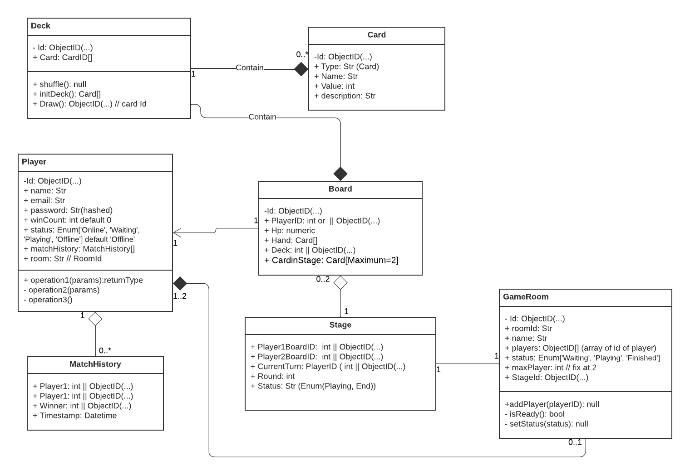

# Clash-of-Cards
two-player card game where players aim to defeat their opponent by playing high-value cards and using special cards to gain an advantage.

## Installation

clone thiis repository

```sh
git clone https://github.com/Tezigudo/Clash-of-Cards.git

cd Clash-of-Cards
```

install dependency

```sh
yarn install
```

### How to run

```sh
yarn start
```

and go to http://localhost:3000 to play


## Design

this is this project UML Model

[](https://lucid.app/lucidchart/d3757f2f-2c59-4b7b-a04f-68c7d5c123f0/edit?viewport_loc=-256%2C-22%2C2339%2C1347%2CHWEp-vi-RSFO&invitationId=inv_58e4605e-b85c-4534-82d8-35b810ed2c79)


## How to play
TBA


## License
The MIT License (MIT). Please see [License File](LICENSE) File for more information.